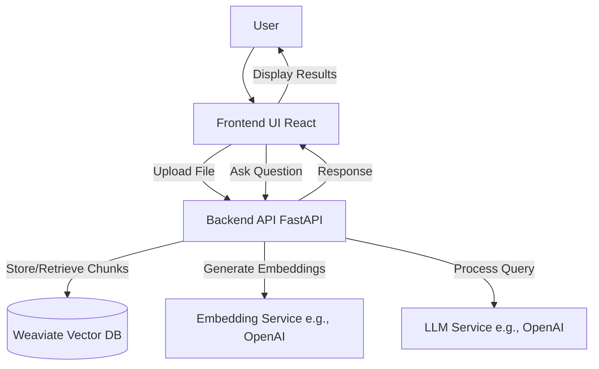

## JARVIS 2.0 Demo - System Design

This document outlines the simplified system architecture for the JARVIS 2.0 working demo, based on the provided PRD, FSD, and Tech Stack documents, and updated to reflect the current Weaviate-centric architecture.

### 1. Goal

The goal of this demo is to showcase the core Retrieval-Augmented Generation (RAG) capabilities of JARVIS 2.0, including content ingestion, vector search, and agentic question-answering through a simple web interface.

### 2. Scope (Demo Limitations)

To deliver a working demo within a reasonable timeframe, the scope will be limited compared to the full JARVIS 2.0 specification:

*   **Ingestion**: Focus on PDF, plain text, and JSON file ingestion. Support for image parsing will be omitted for the initial demo.
*   **Chunking**: Use a basic recursive character text splitter (e.g., from LangChain).
*   **Metadata**: Store basic metadata (filename, source type, chunk index, original document ID).
*   **Memory System**: The Knowledge Graph and advanced memory management (contradiction detection, fact extraction) will be omitted. The focus is on vector store retrieval from Weaviate.
*   **Reasoning Engine**: Implement a ReAct agent using LangChain with a retrieval tool.
*   **LLM**: Utilize an external LLM API (e.g., OpenAI). Configuration for local models will be omitted for the initial demo.
*   **UI**: A simple web interface for file upload and Q&A. Advanced features like collaboration, insights dashboard, and CLI will be omitted.
*   **Security/Privacy**: Basic API security; advanced encryption and privacy controls are out of scope for the demo.
*   **Scalability/Performance**: Focus on functionality; optimizations for large scale are out of scope.

### 3. Architecture Overview

The demo will consist of three main parts:

1.  **Backend API (Python/FastAPI)**: Handles ingestion, retrieval, and agent logic.
2.  **Frontend UI (React/TypeScript)**: Provides a user interface for interaction.
3.  **Vector Database (Weaviate)**: Stores ingested content chunks, their vector embeddings, and metadata.

### 4. Components

#### 4.1 Backend API (FastAPI)

*   **Language**: Python 3.11+
*   **Framework**: FastAPI
*   **AI Orchestration**: LangChain
*   **Database Interaction**: Weaviate Python Client (`weaviate-client`)
*   **Key Modules**:
    *   `api/`: FastAPI application, routers (`ingest.py`, `query.py`), request/response models.
    *   `core/`:
        *   `config.py`: Manages application settings, including Weaviate and OpenAI credentials.
        *   `weaviate_manager.py`: Handles Weaviate client initialization and schema creation/validation.
        *   `database.py`: (Largely deprecated for core RAG flow, previously for SQL DB).
    *   `services/`: Business logic for ingestion, retrieval, agent.
        *   `ingestion_service.py`: Handles file parsing (PDF, TXT, JSON), chunking, embedding generation, and batch storage in Weaviate.
        *   `retrieval_service.py`: Implements vector search against Weaviate using `near_vector` queries.
        *   `agent_service.py`: Sets up and runs the LangChain ReAct agent with the retrieval tool.
    *   `models/`: Contains `document.py` (Pydantic model, likely unused by core Weaviate flow which uses dicts).
    *   `schemas/`: Pydantic schemas for API validation (e.g., `schemas/document.py`).

#### 4.2 Frontend UI (React)

*   **Language**: TypeScript
*   **Framework**: React
*   **Build Tool**: Vite
*   **Data Fetching**: Custom `apiClient.ts` (likely using `fetch` or `axios`).
*   **Styling**: CSS (e.g., `App.css`, `index.css`).
*   **Key Components**:
    *   `FileUpload.tsx`: Component for uploading supported files.
    *   `ChatInterface.tsx`: Component for asking questions and displaying responses.

#### 4.3 Vector Database (Weaviate)

*   **Database**: Weaviate (Cloud or self-hosted)
*   **Client Library**: `weaviate-client` for Python.
*   **Schema**: Managed by `backend/core/weaviate_manager.py`. The "Documents" collection stores:
    *   `content`: Text content of the chunk.
    *   `source_filename`: Original filename.
    *   `chunk_index`: Index of the chunk.
    *   `doc_id`: UUID of the original document.
    *   Vector embeddings (pre-computed by OpenAI).
    *   Other optional metadata like `author`, `creation_date`.

### 5. Data Flow

#### 5.1 Ingestion Flow

1.  User uploads a file (PDF, TXT, JSON) via the Frontend UI.
2.  Frontend sends the file to the Backend API (`/api/ingest/upload` endpoint).
3.  Backend API (`ingestion_service.py`):
    *   Parses the file content based on its type.
    *   Splits the content into manageable chunks.
    *   Generates vector embeddings for each chunk using an external service (OpenAI).
    *   Obtains a Weaviate client via `weaviate_manager.get_weaviate_client()`.
    *   Ensures schema exists using `weaviate_manager.ensure_schema_exists()`.
    *   Batch-inserts the chunks (as dictionaries including properties and vectors) into the Weaviate "Documents" collection.
4.  Backend API returns a list of processed chunk IDs or success/failure status to the Frontend.

#### 5.2 Query Flow (RAG)

1.  User asks a question via the Frontend UI.
2.  Frontend sends the question to the Backend API (`/api/query/ask` endpoint).
3.  Backend API (`agent_service.py`):
    *   Initializes a LangChain ReAct agent.
    *   The agent uses a Retrieval Tool (powered by `retrieval_service.py`).
    *   Retrieval Tool (`retrieval_service.py`):
        *   Generates an embedding for the user's query (OpenAI).
        *   Obtains a Weaviate client via `weaviate_manager.get_weaviate_client()`.
        *   Queries the Weaviate "Documents" collection using `near_vector` search for relevant chunks.
        *   Returns relevant chunks (as dictionaries) to the agent.
    *   The agent synthesizes the retrieved chunks and the original question.
    *   The agent interacts with an external LLM (OpenAI) to generate a final answer, citing sources (chunks).
4.  Backend API returns the final answer, sources, and thought process to the Frontend.
5.  Frontend displays the answer to the user.

### 6. Technology Choices (Confirmation - Updated)

*   **Backend**: Python 3.11+, FastAPI, LangChain.
*   **Frontend**: React, TypeScript, Vite.
*   **Vector Database**: Weaviate (using `weaviate-client`).
*   **Embeddings/LLM**: External APIs like OpenAI.
*   **Dependency Management**: `requirements.txt` (Poetry also present with `pyproject.toml`, `poetry.lock`).
*   **Containerization**: Docker (planned/available as per `tech_stack.md`).
