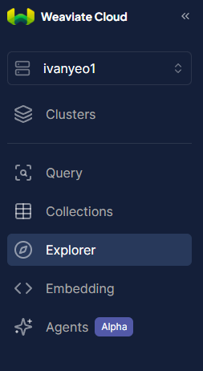

# Active Context: JARVIS 2.0 (As of May 2025)

## 1. Current Work Focus & Recent Major Changes

The immediate past work involved a significant refactoring of the JARVIS 2.0 backend to standardize on **Weaviate** as the exclusive vector database and primary data store.

**Key Refactoring Achievements:**

*   **Weaviate Centralization:** All backend services (`ingestion_service.py`, `retrieval_service.py`, `agent_service.py`) and API routers (`ingest.py`, `query.py`) now directly utilize a Weaviate client obtained from `backend/core/weaviate_manager.py`.
*   **Removal of Abstraction:** The `WeaviateDBService` class previously in `backend/core/database.py` (and its associated `get_db` FastAPI dependency) has been eliminated. Services interact with the Weaviate Python client directly.
*   **Database Simplification:** Mentions and remnants of FAISS and PostgreSQL have been removed from the core data flow, focusing solely on Weaviate.
*   **Data Handling:**
    *   Ingestion service now prepares data as dictionaries for Weaviate's batch insertion.
    *   Retrieval service now expects dictionaries from Weaviate queries.
*   **Verification:** `backend/core/weaviate_manager.py` (for client init and schema) and `backend/core/config.py` (for Weaviate settings) were confirmed to be correctly set up for this new approach.
*   **`backend/models/document.py`:** The `Document` Pydantic model in this file is now considered likely unused by the core Weaviate data flow, as services work directly with dictionaries for Weaviate.

This refactoring was concluded and marked as complete.
**Subsequent troubleshooting (current session) has resolved server startup issues related to Python imports, .env file loading, and Weaviate schema definition (Tokenization). The backend server now starts successfully and connects to Weaviate, and an initial query test was successful.**

## 2. Immediate Next Steps (Post-Refactoring & Troubleshooting)

Based on discussions and recent success, the logical next steps are:

1.  **Thorough End-to-End Testing (Structured):**
    *   **Status:** Initial successful query performed.
    *   **Objective:** Fully verify the end-to-end functionality of the application, particularly the ingestion pipeline for new files.
    *   **Areas:**
        *   Ingest a known new `.txt` file.
        *   Query against the content of the newly ingested file.
        *   Verify answer correctness and source attribution.
2.  **Documentation Update:**
    *   **Status:** Complete (as of 2025-05-08).
    *   **Objective:** Ensure all project documentation accurately reflects the Weaviate-centric architecture.
    *   **Files Updated:**
        *   `docs/DESIGN.MD`
        *   `docs/INSTALLATION.MD`
        *   `docs/tech_stack.md`
        *   This Memory Bank itself (ongoing).
3.  **New Feature Development - JSON Ingestion:**
    *   **Objective:** Implement robust parsing and ingestion for `.json` files, specifically targeting exports from AI platforms like ChatGPT, Claude, etc.
    *   **User Confirmation:** "enabling .json file formats should suffice for now."
    *   **Implementation Target:** This feature will build upon the newly refactored Weaviate backend.

## 3. Active Decisions & Considerations

*   **Weaviate as the Source of Truth:** All document data, embeddings, and queryable metadata reside in Weaviate.
*   **Direct Client Usage:** The pattern of services directly using the Weaviate client (via `weaviate-manager`) is the established standard. Avoid reintroducing abstraction layers for basic Weaviate operations unless a compelling new reason arises.
*   **Data Format for Weaviate:** Continue using Python dictionaries for data exchange with Weaviate, as this aligns with the `weaviate-client` library's interface.
*   **Async Operations:** Maintain the use of `async/await` for all I/O-bound operations, particularly those involving Weaviate and OpenAI.

## 4. Important Patterns & Preferences (Reiterated from Refactoring)

*   **Modularity:** Emphasize clear separation of concerns between API routers, services, and core components like `weaviate_manager`.
*   **Configuration Management:** Utilize `backend/core/config.py` and `.env` files for managing settings and sensitive credentials.
*   **LangChain for Agent Logic:** Continue leveraging LangChain for the ReAct agent, prompt management, and tool integration.

## 5. Learnings & Project Insights from Recent Work

*   **`replace_in_file` Tool:** Large, sweeping SEARCH blocks can be unreliable. Prefer smaller, more targeted SEARCH/REPLACE blocks for file modifications.
*   **Database Clarity:** Initial assumptions about the database stack (PostgreSQL/FAISS) were incorrect. Clear communication and verification of the current stack are vital. The project has now firmly standardized on Weaviate.
*   **Python Imports & Execution Context:** Running Python applications (especially with tools like Uvicorn) from the project root directory (containing the main package) rather than from within the package directory itself is crucial for correct module resolution. Adjusting `sys.path` or using relative imports carefully is an alternative but running from root is often cleaner.
*   **`.env` File Loading:** When running from a project root, ensure Pydantic's `Settings.Config.env_file` path is relative to that root (e.g., `backend/.env` if the `.env` is in the `backend` subdirectory).
*   **Weaviate Schema Definitions:** Pay close attention to the specific enums and string literals required by the Weaviate Python client version for schema properties like `tokenization`. (e.g., `wvc.config.Tokenization.FIELD` vs. string literals).

This `activeContext.md` file serves as the immediate guide for ongoing work, ensuring continuity and focus on the most relevant tasks and established patterns.
